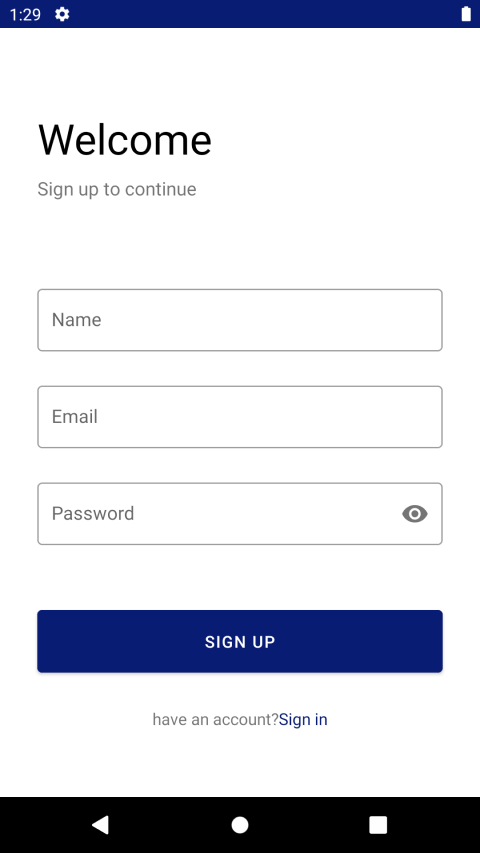
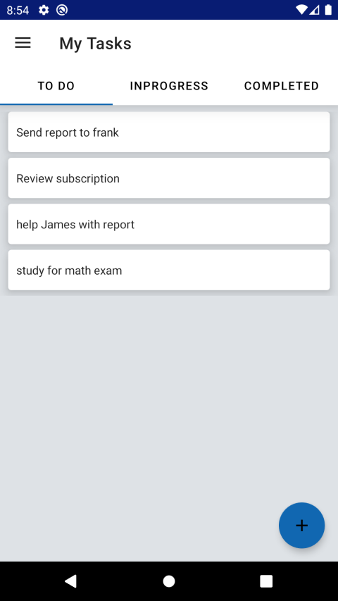

* Task manager app helps you keep track of your tasks and manage tasks effectively.

## This app uses or contain the following:
* This app uses MVVM architecture.
* Material design components.
* Firebase authentication, users can sign up using email address.
* viewpager 2.
* Firebase realtime database to store users data.
* Offline cache.
* Data Binding.
* RecyclerView.
* Android jetpack library.
* Navigation component with nav drawer
* Shared element transition.

## Screenshots

